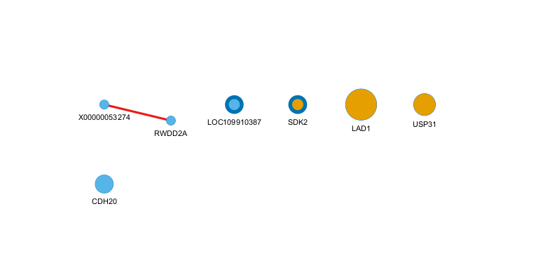
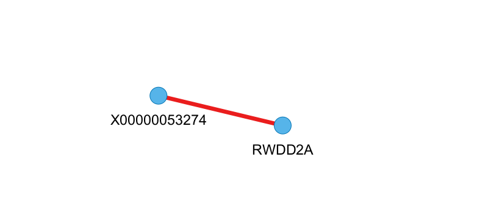

## Library

```{r}
library(R.ROSETTA)
library(rJava)
library(rmcfs)
library(RCy3)
library(csVisuNet)
library(org.Mmu.eg.db)
library(clusterProfiler)
```

## Data

Load the data.

```{r}
df <- read.csv(file.path(
  #   "2026 VT",
  #   "Knowledge_based_systems",
  #   "Project",
  "Project3.csv"
))
```

```{r}
df[, 65:71] |>
  head() |>
  knitr::kable()
```

```{r}
table(df$protectionStatus) |>
  as.data.frame() |>
  `names<-`(c("Protection status", "Frequency")) |>
  knitr::kable()
```

## Monte Carlo Feature Selection

MCFS feature selection.

```{r}
result_mcfs <- mcfs(
  protectionStatus ~ .,
  df,
  projections = 3000,
  projectionSize = 0.05,
  splits = 3,
  splitSetSize = 50,
  cutoffPermutations = 100,
  threadsNumber = 7
)
```

```{r}
#| fig-cap: MCFS projection convergence.
#| label: fig-mcfs_convergence
plot(result_mcfs, type = "distances")
```

Significant features.

```{r}
result_mcfs$RI[1:result_mcfs$cutoff_value, ] |>
  knitr::kable()
```

```{r}
features <- result_mcfs$RI[result_mcfs$RI$RI > 0.05, ]$attribute
df_MCFS <- df[c(features, "protectionStatus")]
```

```{r}
#| fig-cap: Interdependency graph.
#| label: fig-idgraph
gid <- build.idgraph(result_mcfs, size = 20)
plot.idgraph(gid, label_dist = 0.3)
```

## ROSETTA

Can't do VSN normalization because only 39 rows. Could transpose, normalize, then transpose back?

```{r}
JohnsonParam <- list(
  Module = TRUE,
  BRT = TRUE,
  BRTprec = 0.99,
  Precompute = TRUE,
  Approximate = TRUE,
  Fraction = 0.99
)

# df_vsn_full <- vsn::justvsn(as.matrix(df[, 1:70]))
# df_vsn_MCFS <- df_vsn_full[c(features, "protectionStatus")]

df_ros_list <- list(
  full = df,
  MCFS = df_MCFS
  #   full_vsn = df_vsn_full,
  #   MCFS_vsn = df_vsn_MCFS
)
```

Run rosetta on the full and MCFS datasets.

```{r}
ros_full <- rosetta(
  df,
  roc = TRUE,
  clroc = "Prot",
  cvNum = 5,
  reducer = "Genetic",
  JohnsonParam = JohnsonParam
)
ros_MCFS <- rosetta(
  df_MCFS,
  clroc = "Prot",
  roc = TRUE,
  cvNum = 5,
  reducer = "Genetic",
  JohnsonParam = JohnsonParam
)
```

QC rosetta on full dataset.

```{r}
ros_full$quality |>
  tidyr::pivot_longer(
    cols = everything(),
    names_to = "metric",
    values_to = "value"
  ) |>
  knitr::kable()
plotMeanROC(ros_full)
```

QC on rosetta MCFS dataset.

```{r}
ros_MCFS$quality |>
  tidyr::pivot_longer(
    cols = everything(),
    names_to = "metric",
    values_to = "value"
  ) |>
  knitr::kable()
plotMeanROC(ros_MCFS)
```

## Rules

Look at rules for full dataset.

```{r}
rules_full <- ros_full$main
rls_ros_full <- viewRules(
  rules_full[rules_full$decision == "Prot", ],
  setLabels = TRUE,
  labels = c("low", "medium", "high")
)
rls_ros_full[1:12, ] |> knitr::kable()
```

Look at MCFS rules.

```{r}
rules_mcfs <- ros_MCFS$main
rls_ros_MCFS <- viewRules(
  rules_mcfs[rules_mcfs$decision == "Prot", ],
  setLabels = TRUE,
  labels = c("low", "medium", "high")
)
rls_ros_MCFS[1:12, ] |> knitr::kable()
```

### Recalculate rules

Recalculate rules on full dataset.

```{r}
#| label: recalculate full
rec_rules_full <- recalculateRules(df, rules_full)
rec_rls_ros_full <- viewRules(
  rec_rules_full[rec_rules_full$decision == "Prot", ],
  setLabels = TRUE,
  labels = c("low", "medium", "high")
)
rec_rls_ros_full[1:12, ] |> knitr::kable()
```

Recalculate rules on MCFS dataset.

```{r}
#| label: recalculate mcfs
rec_rules_mcfs <- recalculateRules(df_MCFS, rules_mcfs)
rec_rls_ros_MCFS <- viewRules(
  rec_rules_mcfs[rec_rules_mcfs$decision == "Prot", ],
  setLabels = TRUE,
  labels = c("low", "medium", "high")
)
rec_rls_ros_MCFS[1:12, ] |> knitr::kable()
```

## VisuNet

Error in `colnames<-`:
! attempt to set 'colnames' on an object with less than two dimensions

```{r}
#| eval: false
#| label: visunet_full
cytoscapePing()
visunetcyto(ros_full$main) # Failed to load into cytoscape
vis_full <- visunet(ros_full$main)
saveRDS(vis_full, "vis_full.RDS")
```

But this worked.

```{r}
#| eval: false
#| label: visunet_mcfs
cytoscapePing()
visunetcyto(ros_MCFS$main)
vis_mfcs <- visunet(ros_MCFS$main)
saveRDS(vis_mfcs, "vis_mcfs.RDS")
```

```{r}
# vis_mcfs <- readRDS("2026 VT/Knowledge_based_systems/Project/vis_mcfs_final.RDS")

```

Interdependency graph for MCFS dataset.

```{r}
gid <- build.idgraph(result_mcfs, size = 20)
plot.idgraph(gid, label_dist = 0.3)
```





## Rule visualization

Visualize the new rules on the full dataset. This fails.

```{r}
#| label: plot rules full
# plotRule(
#   df,
#   rec_rules_full,
#   type = "heatmap",
#   discrete = FALSE,
#   ind = 5,
#   label = c('low', 'medium')
# )
# plotRule(
#   df,
#   rec_rules_full,
#   type = "boxplot",
#   discrete = FALSE,
#   label = c('low', 'medium')
# )
```

Visualize the new rules on the MCFS dataset.

```{r}
#| label: plot rules mcfs
# set new labels for plots using parameter label=c()
plotRule(
  df_MCFS, # dataset
  rec_rules_mcfs, # rules
  type = "heatmap",
  discrete = FALSE,
  ind = 5,
  label = c('low', 'medium')
)
plotRule(
  df_MCFS,
  rec_rules_mcfs,
  type = "boxplot",
  discrete = FALSE,
  label = c('low', 'medium')
)
```

## Pathway analysis

Load the visuNet results back in.

```{r}
vis_full <- readRDS("vis_full.RDS")
vis_mcfs <- readRDS("vis_mcfs.RDS")
```

How to do pathway analysis? 

```{r}
# gsea_genes_full <- data.frame(
#     gene = c(),
#     regulation <- c(),
#     decision <- c()
# )
gsea_genes_full <- c(
  "LOC109910387",
  "LOC114672915",
  "KIR3DL0",
  "CD300LD",
  "ENSMMUG00000064369",
  "ENSMMUG00000053012",
  "VSTM1",
  "X00000037843",
  "AZU1",
  "ENSMMUG00000058729",
  "WDR41",
  "C5H4orf45",
  "ULK4",
  "SMIM2",
  "CDH20"
)
gsea_genes_mcfs <- c(
  "KIR3DL0",
  "ENSMMUG00000037843",
  "CDH20",
  "SDK2",
  "ENSMMUG00000053274",
  "CDH20",
  "F5",
  "KIR3DL0"
)
```

ENSMMUG00000037843(low) -> Prot, (high) -> NonProt
CDH20(high) -> Prot, (low) -> NonProt
ENSMMUG00000053274(high) -> Prot, (low) -> NonProt
SDK2(high) -> Prot, (low) -> NonProt
LAD1(high) -> NonProt, (medium) -> Prot (combind SDK2)
ENSMMUG00000064313

```{r}
gsea_genes_full_entrez <- bitr(
  gsea_genes_full,
  fromType = 'SYMBOL',
  toType = c("ENTREZID"),
  org.Mmu.eg.db
)
gsea_genes_mcfs_entrez <- bitr(
  gsea_genes_mcfs,
  fromType = 'SYMBOL',
  toType = c("ENTREZID"),
  org.Mmu.eg.db
)
```

```{r}
gsea_GO_full <- enrichGO(
  gene = gsea_genes_full_entrez$ENTREZID,
  OrgDb = org.Mmu.eg.db,
  ont = "MF",
  pvalueCutoff = 0.05,
  readable = TRUE
)
```


```{r}
gene_entrez_full <- bitr(
  unique(as.character(vis_full$all$nodes$label)),
  fromType = 'SYMBOL',
  toType = c("ENTREZID"),
  org.Mmu.eg.db
)

gene_entrez_mcfs <- bitr(
  unique(as.character(vis_mcfs$all$nodes$label)),
  fromType = 'SYMBOL',
  toType = c("ENTREZID"),
  org.Mmu.eg.db
)
```

```{r}
genes_GO_full <- groupGO(
  gene = unique(gene_entrez_full$ENTREZID),
  OrgDb = org.Mmu.eg.db,
  ont = "MF",
  level = 5,
  readable = TRUE
)

genes_GO_mcfs <- groupGO(
  gene = unique(gene_entrez_mcfs$ENTREZID),
  OrgDb = org.Mmu.eg.db,
  ont = "MF",
  level = 5,
  readable = TRUE
)
```

```{r}
pathway_reactome_full <- enrichPathway(
  gene = unique(gene_entrez_full$ENTREZID),
  organism = "org.Mmu.eg.db",
  pvalueCutoff = 0.05,
  readable = TRUE
)
```

Plots fail.

```{r}
# x1 <- summary(genes_GO_full)[
#   which(summary(genes_GO_full)$Count > 1),
#   c('ID', 'Count')
# ]
# x <- as.numeric(x1[, 2])
# names(x) <- x1$ID
# barplot(x, col = rainbow(20), las = 2)
```

```{r}
# x1 <- summary(genes_GO_mcfs)[
#   which(summary(genes_GO_mcfs)$Count > 1),
#   c('ID', 'Count')
# ]
# x <- as.numeric(x1[, 2])
# names(x) <- x1$ID
# barplot(x, col = rainbow(20), las = 2)
```

```{r}
genes_GO_full@result[genes_GO_full@result$Count > 0, ] |>
  knitr::kable()
```

```{r}
genes_GO_mcfs@result[genes_GO_mcfs@result$Count > 0, ] |>
  knitr::kable()
```
