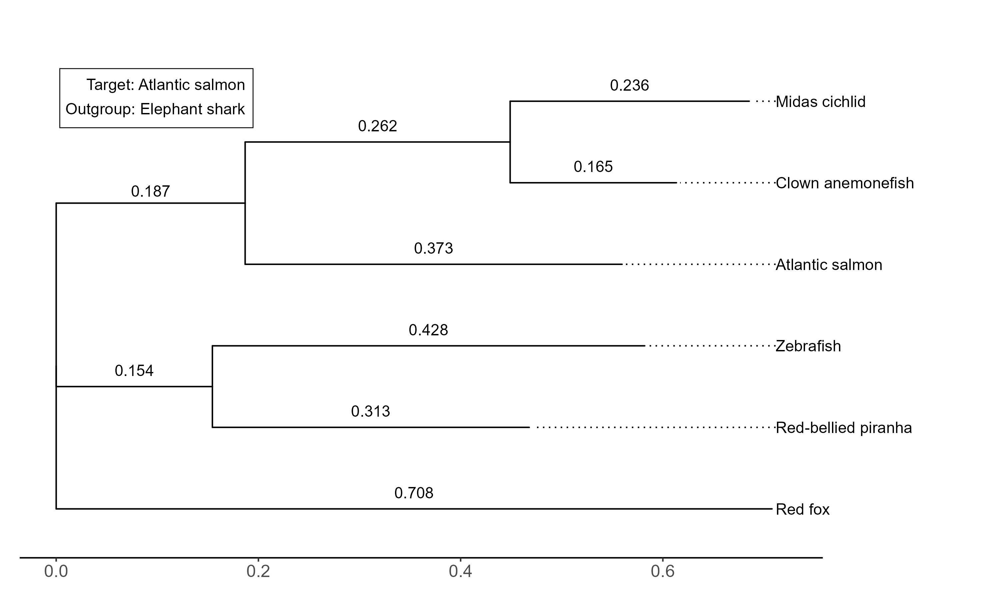

```{r}
#| include: false
source("project_script.R")
result_LRT <- readRDS("result_LRT.rds")
result_dNdS <- readRDS("result_dNdS.rds")
```

## Introduction

Telomeres are a region found at the ends of eucaryotic chromosomes. They consist of 5'-TTAGGG-3' tandem repeats with a single-stranded overhang [@stanselTloopAssemblyVitro2001] and serve to protect the chromosome from DNA reparation mechanism and fusing with other chromosomes [@ancelinRoleTelomericDNAbinding1998; @delangeProtectionMammalianTelomeres2002]. The telomeric repeat binding factor 2 (TERF2) is a protein coding gene mainly involved in maintaining telomere length and, above all, protecting chromosome ends by means of capping to protect from 3' flap nucleases [@ancelinRoleTelomericDNAbinding1998; @delangeProtectionMammalianTelomeres2002; @hockemeyerPOT1ProtectsTelomeres2005]. Apart from binding to telomeric DNA itself, TERF2 forms a complex with and recruits multiple other proteins [@kimTIN2MediatesFunctions2004; @delangeProtectionMammalianTelomeres2002] to both regulate the telomere length [@smogorzewskaControlHumanTelomere2000] and bundle the telomere into t-loops [@stanselTloopAssemblyVitro2001]. 

This study focuses on investigating the selection preassure on the TERF2 gene across five species of teleosts with a special focus on the Atlantic salmon (_Salmo salar_). 

## Method

Gene sequences were obtained from Ensembl [@dyerEnsembl20252025] and aligned using PRANK [@loytynojaPhylogenyawareAlignmentPRANK2014] with a codon-aware method. A phylogenetic tree was constructed with IQ-TREE (version 1.6.12) [@trifinopoulosWIQTREEFastOnline2016]. Selection preassure was estimated using codeml from PAML [@yangPAML4Phylogenetic2007] according to models in @tbl-models and models were compared using likelihood ratio tests (LRT).

```{r}
#| echo: false
#| tbl-cap: Model parameters used for estimating selection presure on the TERF2 gene.
#| label: tbl-models
tbl_models <- data.frame(
  Model = c("A", "B", "C"),
  Model_param = c(0, 0, 1),
  fix_omega = c(1, 0, 0),
  omega = c(1, 1, 1),
  Description = c(
    "Neutral evolution (dN/dS fixed at 1)",
    "Similar selection across species",
    "Different selection per species"
  ),
  stringsAsFactors = FALSE
)

knitr::kable(
  tbl_models,
  col.names = c("", "Model param", "fix_omega", "omega", "Description"),
  format = "markdown"
)
```

Github Copilot with model GPT-5 mini was used for code compleation and generating R-code.

## Results

Models used for estimating selection preassure on the TERF2 gene (@tbl-models) simulate neutral evolution (Model A, null hypothesis), similar selection preassure across species (Model B) and different selection preassure per species (Model C). Comparing models A and B indicated a difference between models (p = `{r} format(result_LRT$Model_A_vs_B$p_value, format = "f", digits = 3)`), and model B against C indicated no difference.





## Discussion

Seeing as a dN/dS not fixed at one (i.e. allowed to vary) resulted in a better model (Model B), there is some form of selection on the TERF2 gene. A dN/dS < 1 indicates a purifying selection and that the TERF2 function is likely vital to an individuals viability.


::: {.page-break}
:::

## References


## Appendix